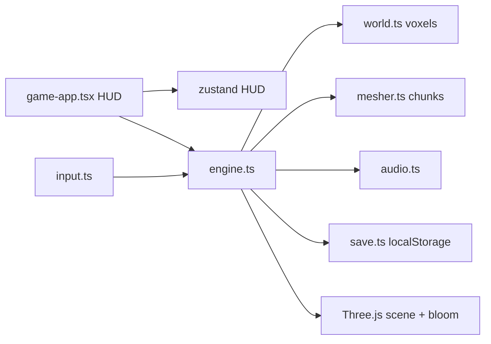

# PLAN — KI BLOX

Stand: 2026-08-23. Spielbar im Browser, Singleplayer, kein Backend.

## 1. Vision

Ein First-Person-Voxel-Spiel, das sich in unter einer Minute begreifen lässt:
lauft, baut, fliegt, kämpft mit Ki, sammelt sieben Kugeln, ruft den Drachen.
Stimmung **Namek bei Dämmerung** — grünes Gras, hohe Stämme, Kristalladern,
Bloom — nicht Pixel-Minecraft-Klon und nicht offizielles Dragon-Ball-Spiel.

Eine Session: Welt lädt → Spawn an der Hütte → Kugeln jagen / bauen / Gegner
→ Shenron → Wunsch → weiterfliegen.

## 2. Säulen

1. **Sofort spielen.** Titel, ein Knopf, Pointer Lock. Save automatisch.
2. **Lesbare Physik.** FPS-Strafe (W vor, A/D seitlich), 1-Block-Step-up,
   Schwimmen nach oben, Flug mit Steigen/Sinken.
3. **Ki statt Inventar-RPG.** Power-Zahl, Energieleiste, eine Transformation.
4. **Kleine, dichte Welt.** 128×64×128 reicht für Jagd, Bau und Luftkampf.
   Kein Streaming, kein Infinite-Gen in v1.
5. **Offline.** `localStorage` only. Auth und DB bleiben aus.

## 3. Architektur

- **GameEngine** besitzt Szene, Composer, Spieler, Gegner, Blasts, Chunk-Meshes.
- **World** ist ein `Uint8Array` plus Spawns. Edits sind ein Ring von max. 2500
  `[x,y,z,id]`-Tupeln im Save.
- **Input** sammelt Kanten (pressed/released) einmal pro Frame. Ghost-Pads
  mit ≥6 gedrückten Buttons werden ignoriert.
- **HUD** ist React über Canvas. Phasen: `title | loading | playing | paused | wish | dead`.

### Weltgen

Seeded Simplex:

- Höhenfeld + Ridge + Warp
- Stein / Erde / Namek-Gras, Sand an feuchten Küsten, Wasser bis Sea-Level 15
- Höhlen (3D-Noise), Ki-Adern im Stein, Moos am Wasser
- ~220 Namek-Bäume, 7 schwebende Ki-Inseln, Holzhütte als Spawn
- 7 Drachenkugeln auf einem Ring um die Mitte (`scatterBalls`)
- bis 16 Gegner (grunt / shooter / flyer), Spawn-Radius freihalten

### Grafik

- Atlas aus Canvas (kein Bild-Import für Blöcke)
- Chunk-Meshing mit Ambient Occlusion
- UnrealBloom + OutputPass
- Wolken, Wasser-Planes, Aura im Super-Saiyan
- Shenron als einfache Group-Geometrie, kein GLTF

### Kampf

| Aktion | Quelle | Kosten |
|--------|--------|--------|
| Schlag / Mine | Hold primary | Härte nach Block |
| Ki-Stoß | Q charge-release | Energie, Schaden skaliert mit Charge + Power |
| Dash | R | Energie |
| Super Saiyan | F, Power ≥ 4500 | Energie/s, Speed × 1.75 |
| Spawn-I-Frames | nach Start / Respawn | 1.4–1.5 s |

## 4. Balancing (v1)

Aus [`src/game/constants.ts`](./src/game/constants.ts):

| Konstante | Wert |
|-----------|------|
| Welt | 128 × 64 × 128, Chunk 16 |
| Walk / Sprint / Fly | 6.4 / 9.8 / 16 |
| Super-Saiyan-Mult | 1.75 |
| Sprung / Gravity | 8.6 / 24 |
| SSJ-Schwelle | 4500 Ki |
| Start-Ki / HP / Energie | 320 / 100 / 100 |
| Reichweite | 6.8 |
| Hotbar | Gras, Erde, Stein, Holz, Ki-Kristall |

## 5. Nicht-Ziele (v1)

- Accounts, Leaderboards, Cloud-Save
- Unendliche Welt / Dimensionen
- Crafting-Bäume, Quests, Dialog
- Offizielle Dragon-Ball-Assets
- Server-autoritativer Multiplayer

P2P-Helfer unter `src/lib/multiplayer` existieren im Workspace-Gerüst und
werden **nicht** verdrahtet, bis ROADMAP das explizit öffnet.

## 6. Qualität

Vor einem öffentlichen Stand:

- `npm run typecheck` sauber
- Production-Build läuft
- Desktop + Touch: Titel → Spielen → Pause → WASD/Stick korrekt
- Primary-Button setzt **fort**, regeneriert die Welt nicht
- Pointer Lock am User-Gesture, nicht nach `await` auf Chunks
