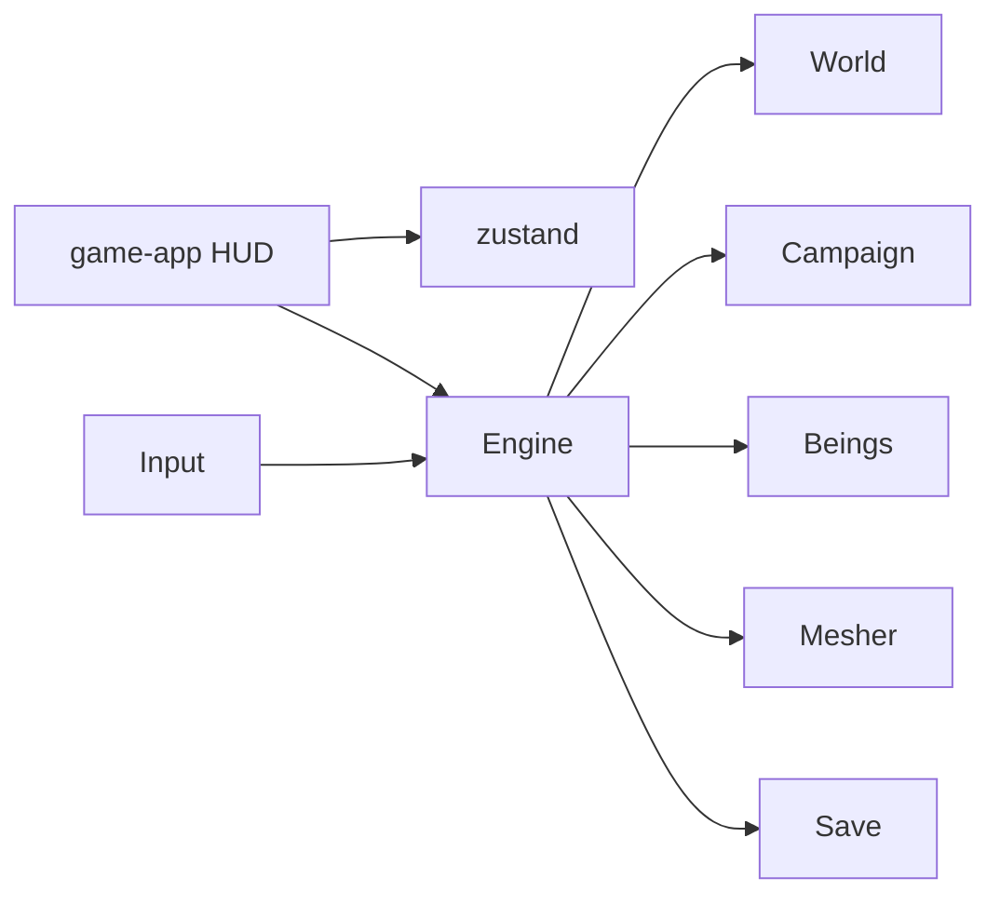

# PLAN — KI BLOX

Stand: 2026-08-27. v0.7.0. Browser, Singleplayer, kein Backend.

## 1. Vision

Minecraft-Knochen, Dragon-Ball-Blut. First-Person-Voxel, in einer Minute klar:
laufen, bauen, fliegen, Ki, sieben Kugeln, Orryx. Kampagne über fünf Planeten
mit eigenen Völkern — keine Franchise-Kopien.

Session: Titel → Kampagne → Venn → Kugeln / Boss → Tor → nächste Welt.

## 2. Säulen

1. **Sofort spielen.** Ein Knopf. Save automatisch.
2. **Lesbare Physik.** FPS-Strafe, Step-up, Snap-down, Void-Rescue, Schwimmen.
3. **Ki statt Inventar-RPG.** Power, Energie, eine Transformation.
4. **Dichte 128er-Welten.** Ein Planet zur Zeit, Travel regeneriert.
5. **Offline.** `localStorage` v7. Auth/DB aus.

## 3. Architektur

- **campaign.ts** Planeten, Völker, Quest-Stufen, Dialog.
- **beings.ts** Minecraft-Humanoids (32 px / 1.8 m), Pixel-Gesicht/Gi, Gelenk-Walk/Fly/Punch.
- **World** `Uint8Array`, Planet-Palette, NPC + Boss-Spawn, Loch-Dichtung.
- **HUD-Phasen:** title, loading, playing, paused, wish, dead, story, warp.

### Physik (Fall)

- AABB vs Voxel, Substep, Step-up, klebriger Support-Y (gegen 1-Block-Löcher).
- Blätter begehbar, Kronen dichter. Oberfläche ohne Speckle-Löcher.
- `py` wird nicht in Bedrock geklemmt. Fallgeschwindigkeit gekappt.
- Unter y 1: Rescue auf Oberfläche oder Spawn.

### Grafik

- Atlas 4×8, Planet-Skies, Dialog-Portraits.
- Kein UnrealBloom (schwarzer Frame auf Software-GL).
- Wesen: Pixel-Box-Körper, Spezies-Haare/Hörner/Visier, Aura an Elite/Lord.
- Titelkamera zeigt den Solari-Helden.

## 4. Kampagne

Verdant → Terra → Cinder → Rime → Aether.
Ki bleibt. Kugeln resetten pro Welt. Boss muss fallen, dann Orryx.

## 5. Nicht in v1

Auth, DB, Multiplayer, Infinite-World, GLTF-Charaktere.
