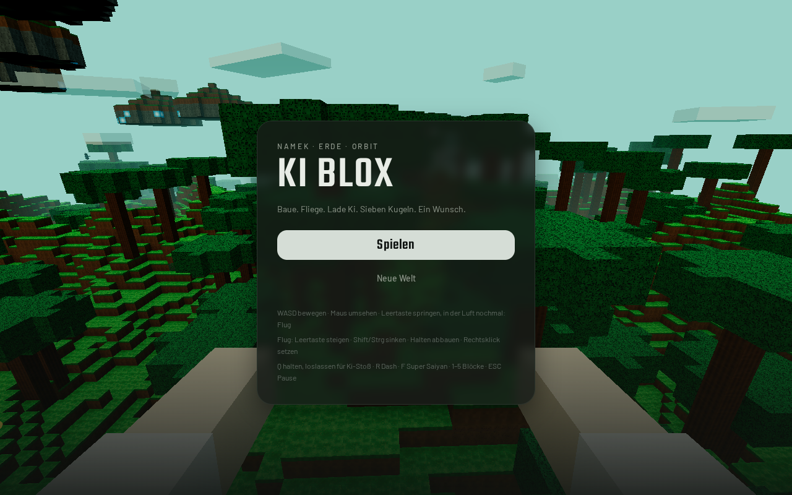
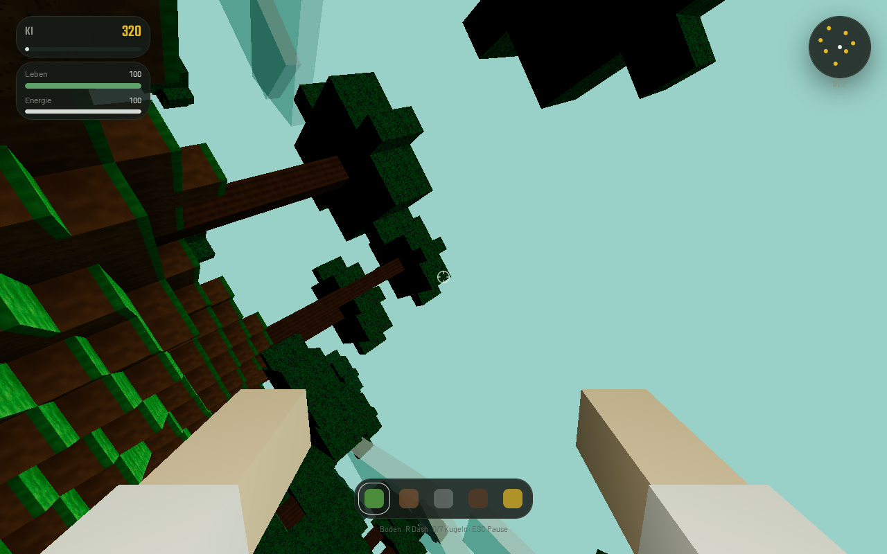

# KI BLOX

Voxel-Welt zum Bauen, Fliegen und Ki-Kampf. First-Person im Browser —
Namek-Hügel, schwebende Kristallinseln, sieben Drachenkugeln, ein Drache.

[](./LICENSE)
[](./package.json)
[](https://threejs.org/)

> **Fan-Projekt.** Unofficial, not affiliated with Toei, Shueisha, Bandai or Mojang.
> Details: [`NOTICE.md`](./NOTICE.md).



**Baue. Fliege. Lade Ki. Sieben Kugeln. Ein Wunsch.**



## Spielen

Fortschritt liegt lokal im Browser (`localStorage`, Schlüssel `kiblox-save-v2`).
Kein Account, keine Cloud.

| | |
|---|---|
| **Ziel** | Sieben Drachenkugeln finden, Shenron rufen, einen Wunsch wählen |
| **Kampf** | Nahkampf, geladener Ki-Stoß, Dash, Super Saiyan ab 4500 Ki |
| **Welt** | 128 × 64 × 128 Blöcke, Chunks 16³, Höhlen, Wasser, Namek-Bäume, Ki-Inseln |
| **Bauen** | Halten = abbauen, Rechtsklick / Platzieren-Taste = setzen, Hotbar 1–5 |

### Steuerung

**Tastatur + Maus**

| Taste | Aktion |
|-------|--------|
| WASD | Laufen (W vor, A links, D rechts — FPS-Strafe, kein Lenken) |
| Maus | Umsehen (Klick sperrt den Pointer; ohne Lock: ziehen) |
| Leertaste | Springen · in der Luft nochmal: Flugmodus |
| Flug + Leertaste | Steigen |
| Flug + Shift / Strg | Sinken |
| Linksklick halten | Abbauen / schlagen |
| Rechtsklick | Block setzen |
| Q halten, loslassen | Geladener Ki-Stoß |
| R | Dash (Energie) |
| F | Super Saiyan (Aura zehrt Energie) |
| 1–5 / Mausrad | Hotbar |
| ESC | Pause |

**Touch**

Stick links, Blick rechts. Flug halten = steigen, loslassen = sinken.
Hotbar antippen. Aktionsknöpfe unten.

**Gamepad** wird mit radialem Deadzone erkannt. Festklebende Buttons feuern
nicht beim Start.

### Wünsche

Sind alle sieben Kugeln vereint, erscheint Shenron:

| Wunsch | Effekt |
|--------|--------|
| Mehr Kraft | +4000 Ki, Energie voll |
| Voller Körper | Leben + Energie voll |
| Neue Jagd | Kugeln neu verstreuen, kleiner Ki-Bonus, Leben voll |

## Technik

| | |
|---|---|
| UI | React 19, TanStack Start / Router, Tailwind v4 |
| 3D | Three.js 0.185 — greedy-ish Chunk-Meshes, Ambient Occlusion, UnrealBloom |
| State | Zustand HUD, `localStorage` Save v2 |
| Audio | Web Audio, synthetisiert (kein Sample-Pack) |
| Input | Pointer Lock + Drag-Look, Touch-Sticks, Gamepad |

```
src/
├── components/game-app.tsx   HUD, Titel, Pause, Wünsche, Touch-Chrome
└── game/
    ├── engine.ts             Loop, Kamera, Kampf, Flug, Save-Flush
    ├── world.ts              Terrain, Bäume, Inseln, Kugeln, Gegner-Spawns
    ├── mesher.ts             Chunk-Geometrie + AO
    ├── textures.ts           Atlas + Drachenkugel-Look
    ├── input.ts              Tastatur, Maus, Touch, Pad
    ├── audio.ts              SFX
    ├── save.ts               localStorage kiblox-save-v2
    ├── store.ts              HUD-Zustand
    ├── constants.ts          Weltgröße, Blöcke, Balancing
    └── rng.ts                Seeded RNG
```

## Entwickeln

```bash
npm install
npm run dev          # Vite, Host 0.0.0.0 Port 8080
npm run typecheck
npm run build
npm run preview
```

Node 22. Auth und Datenbank bleiben **aus** — das Spiel braucht sie nicht.

## Doku

| Datei | Inhalt |
|-------|--------|
| [`PLAN.md`](./PLAN.md) | Design, Architektur, Nicht-Ziele |
| [`PROGRESS.md`](./PROGRESS.md) | Was steht, was ist fest |
| [`ROADMAP.md`](./ROADMAP.md) | Nächste Schritte |
| [`CHANGELOG.md`](./CHANGELOG.md) | Versionen |
| [`CONTRIBUTING.md`](./CONTRIBUTING.md) | Mitmachen |
| [`LICENSE`](./LICENSE) | MIT |
| [`NOTICE.md`](./NOTICE.md) | Fan-Disclaimer |
| [`THIRD_PARTY.md`](./THIRD_PARTY.md) | Abhängigkeiten |

## Lizenz

Code und originale Assets: **MIT** © 2026 Pierreg99 / Cryopg.it.

KI BLOX is an unofficial fan-inspired game and is not affiliated with the
owners of Dragon Ball or Minecraft. See [`NOTICE.md`](./NOTICE.md).

---

### English

First-person voxel sandbox in the browser: build, fly, charge Ki, hunt seven
dragon balls, ask Shenron for a wish. Super Saiyan at 4500 Ki. Progress stays
on-device. React + Three.js. MIT. Unofficial fan work.
